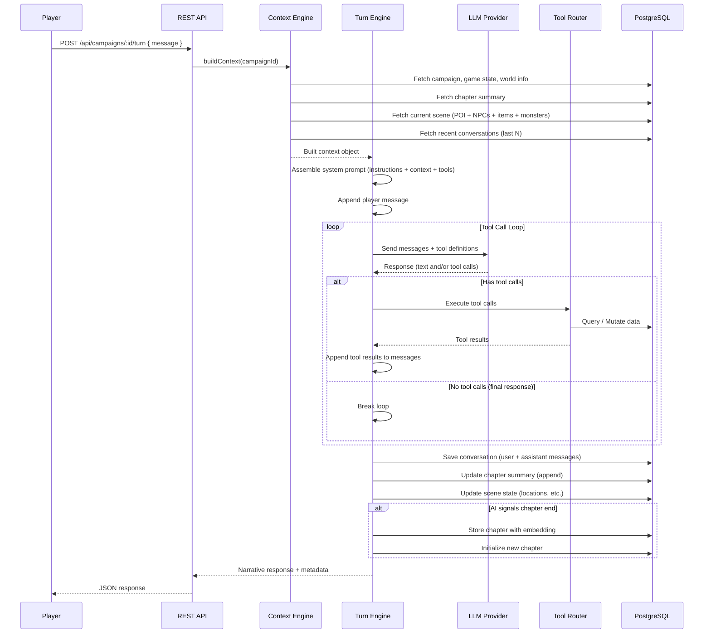

# Agentic DND — Technical Design Document (TDD)

## 1. System Architecture

### 1.1 High-Level Architecture

```
┌─────────────────────────────────────────────────────────────────┐
│                         CLIENT (Vite + React)                   │
│                                                                 │
│  ┌──────────┐  ┌──────────┐  ┌──────────┐  ┌───────────────┐   │
│  │ Chat UI  │  │Character │  │ Campaign │  │  Confirmation │   │
│  │          │  │ Panels   │  │ Creation │  │    Modals     │   │
│  └────┬─────┘  └────┬─────┘  └────┬─────┘  └───────┬───────┘   │
│       └──────────────┴─────────────┴────────────────┘           │
│                            │ HTTP / REST                        │
└────────────────────────────┼────────────────────────────────────┘
                             │
┌────────────────────────────┼────────────────────────────────────┐
│                      SERVER (Node.js + Express)                 │
│                            │                                    │
│  ┌─────────────────────────▼──────────────────────────────┐     │
│  │                    REST API Layer                       │     │
│  │         (Routes → Controllers → Services)              │     │
│  └──────┬──────────────────┬──────────────────┬───────────┘     │
│         │                  │                  │                  │
│  ┌──────▼──────┐  ┌───────▼────────┐  ┌──────▼──────────┐      │
│  │  Campaign   │  │  Agentic Turn  │  │  Character /    │      │
│  │  Generation │  │    Engine      │  │  Inventory      │      │
│  │  Service    │  │                │  │  Services       │      │
│  └──────┬──────┘  └───────┬────────┘  └──────┬──────────┘      │
│         │                 │                   │                  │
│         │          ┌──────▼────────┐          │                  │
│         │          │  Tool Router  │          │                  │
│         │          │  & Executor   │          │                  │
│         │          └──────┬────────┘          │                  │
│         │                 │                   │                  │
│  ┌──────▼─────────────────▼───────────────────▼──────────┐      │
│  │                   LLM Provider (Abstracted)           │      │
│  │            (Switchable: OpenAI / Claude / Gemini)      │      │
│  └───────────────────────────────────────────────────────┘      │
│         │                 │                   │                  │
│  ┌──────▼─────────────────▼───────────────────▼──────────┐      │
│  │                  Data Access Layer                     │      │
│  │                   (Sequelize ORM)                      │      │
│  └───────────────────────┬───────────────────────────────┘      │
│                          │                                      │
└──────────────────────────┼──────────────────────────────────────┘
                           │
               ┌───────────▼───────────────┐
               │  PostgreSQL + pgvector     │
               │                           │
               │  • Game state tables      │
               │  • Vector embeddings      │
               │    (chapter summaries)    │
               └───────────────────────────┘
```

### 1.2 Technology Stack

| Layer | Technology | Rationale |
|---|---|---|
| **Frontend** | Vite + React | Fast dev server, modern React with hooks |
| **Backend** | Node.js + Express | Lightweight, flexible, large ecosystem |
| **ORM** | Sequelize | Mature ORM with PostgreSQL support, migrations, associations |
| **Database** | PostgreSQL 16+ | Robust relational DB, JSONB for flexible schema fields |
| **Vector Search** | pgvector extension | Native PostgreSQL vector search, no external service needed |
| **LLM** | Abstracted provider interface | Switchable between OpenAI, Anthropic, Google, etc. |
| **Embedding** | Provider-dependent | text-embedding-3-small (OpenAI) or equivalent |

### 1.3 Project Structure

```
agentic-dnd/
├── client/                          # Vite + React frontend
│   ├── public/
│   ├── src/
│   │   ├── api/                     # API client functions
│   │   ├── assets/                  # Static assets (fonts, images)
│   │   ├── components/              # Reusable UI components
│   │   │   ├── chat/                # Chat UI components
│   │   │   ├── character/           # Character panel components
│   │   │   ├── common/              # Shared components (buttons, modals)
│   │   │   └── campaign/            # Campaign creation components
│   │   ├── contexts/                # React context providers
│   │   ├── hooks/                   # Custom React hooks
│   │   ├── pages/                   # Page-level components
│   │   ├── styles/                  # Global CSS
│   │   ├── utils/                   # Utility functions
│   │   ├── App.jsx
│   │   └── main.jsx
│   ├── index.html
│   ├── vite.config.js
│   └── package.json
│
├── server/                          # Node.js + Express backend
│   ├── src/
│   │   ├── config/                  # Configuration files
│   │   │   ├── database.js          # Sequelize DB config
│   │   │   └── llm.js              # LLM provider config
│   │   ├── controllers/             # Route handlers
│   │   ├── middlewares/             # Express middlewares
│   │   ├── models/                  # Sequelize model definitions
│   │   ├── routes/                  # Express route definitions
│   │   ├── services/                # Business logic
│   │   │   ├── campaign/            # Campaign generation service
│   │   │   ├── agent/               # Agentic turn engine
│   │   │   │   ├── contextBuilder.js
│   │   │   │   ├── toolRouter.js
│   │   │   │   ├── turnEngine.js
│   │   │   │   └── tools/           # Individual tool implementations
│   │   │   ├── character/           # Character management
│   │   │   ├── llm/                 # LLM abstraction layer
│   │   │   │   ├── provider.js      # Base provider interface
│   │   │   │   ├── openai.js
│   │   │   │   ├── anthropic.js
│   │   │   │   └── gemini.js
│   │   │   └── rag/                 # RAG / vector search service
│   │   ├── utils/                   # Utility functions
│   │   ├── validators/              # Request validation (Joi / Zod)
│   │   └── app.js                   # Express app setup
│   ├── migrations/                  # Sequelize migrations
│   ├── seeders/                     # Seed data
│   ├── .env
│   └── package.json
│
├── PRD.md
├── TDD.md
└── README.md
```

---

## 2. Database Design

### 2.1 Entity Relationship Diagram

```mermaid
erDiagram
    ACCOUNT ||--o{ CAMPAIGN : owns
    CAMPAIGN ||--|| CAMPAIGN_GAME_STATE : has
    CAMPAIGN ||--|| WORLD : has
    CAMPAIGN ||--o{ CHARACTER : has
    CAMPAIGN ||--o{ ITEM : has
    CAMPAIGN ||--o{ CLASS : has
    CAMPAIGN ||--o{ RACE : has
    CAMPAIGN ||--o{ NPC : has
    CAMPAIGN ||--o{ MONSTER : has
    CAMPAIGN ||--o{ MONSTER_INSTANCE : has
    CAMPAIGN ||--o{ SPELL : has
    CAMPAIGN ||--o{ QUEST : has
    CAMPAIGN ||--o{ FACTION : has
    CAMPAIGN ||--o{ LORE : has
    CAMPAIGN ||--o{ CONVERSATION : has
    CAMPAIGN ||--o{ CHAPTER : has

    WORLD ||--|| MAP : has
    MAP ||--o{ AREA : contains
    AREA ||--o{ AREA : "parent_area"
    AREA ||--o{ POI : contains
    AREA ||--o{ LORE : has

    POI ||--o{ POI_ITEM : contains
    POI ||--o{ POI_NPC : contains
    POI ||--o{ POI_MONSTER_INSTANCE : contains
    POI ||--o{ LORE : has

    CHARACTER ||--o{ CHARACTER_FEAT_TRAITS : has
    CHARACTER ||--o{ CHARACTER_RESOURCES : has
    CHARACTER ||--|| CHARACTER_SPELLCASTING : has
    CHARACTER ||--o{ CHARACTER_SPELLS : has
    CHARACTER ||--o{ CHARACTER_STAT_MODIFIER : has
    CHARACTER ||--o{ CHARACTER_EFFECT_MODIFIER : has
    CHARACTER ||--o{ INVENTORY : has
    CHARACTER }o--|| RACE : "belongs_to"
    CHARACTER }o--|| CLASS : "belongs_to"

    INVENTORY }o--|| ITEM : references
    POI_ITEM }o--|| ITEM : references
    POI_NPC }o--|| NPC : references
    POI_MONSTER_INSTANCE }o--|| MONSTER_INSTANCE : references
    MONSTER_INSTANCE }o--|| MONSTER : "instance_of"

    NPC ||--o| NPC_COMBAT_PROFILE : has
    CLASS ||--o{ CLASS_RESOURCES : has
    CLASS ||--o{ CLASS_SPELLS : has
    CLASS_SPELLS }o--|| SPELL : references
    CHARACTER_SPELLS }o--|| SPELL : references

    QUEST }o--o| NPC : "quest_giver"
    QUEST }o--o| POI : "quest_location"

    CAMPAIGN_GAME_STATE }o--o| POI : "current_poi"
```

### 2.2 Table Definitions

All tables use UUID v4 as primary key unless noted otherwise. Timestamps (`created_at`, `updated_at`) are included on all tables via Sequelize defaults.

#### 2.2.1 Account & Campaign

```sql
CREATE TABLE accounts (
    id UUID PRIMARY KEY DEFAULT gen_random_uuid(),
    username VARCHAR(50) NOT NULL UNIQUE,
    email VARCHAR(255) NOT NULL UNIQUE,
    password VARCHAR(255) NOT NULL,  -- bcrypt hashed
    created_at TIMESTAMPTZ NOT NULL DEFAULT NOW(),
    updated_at TIMESTAMPTZ NOT NULL DEFAULT NOW()
);

CREATE TABLE campaigns (
    id UUID PRIMARY KEY DEFAULT gen_random_uuid(),
    account_id UUID NOT NULL REFERENCES accounts(id) ON DELETE CASCADE,
    name VARCHAR(255) NOT NULL,
    created_at TIMESTAMPTZ NOT NULL DEFAULT NOW(),
    updated_at TIMESTAMPTZ NOT NULL DEFAULT NOW()
);

CREATE TABLE campaign_game_states (
    id UUID PRIMARY KEY DEFAULT gen_random_uuid(),
    campaign_id UUID NOT NULL UNIQUE REFERENCES campaigns(id) ON DELETE CASCADE,
    mode VARCHAR(20) NOT NULL DEFAULT 'narrative',  -- 'narrative' | 'combat' | etc.
    party_level INTEGER NOT NULL DEFAULT 1,
    short_rest_count INTEGER NOT NULL DEFAULT 0,
    in_game_time VARCHAR(100),          -- e.g. "Day 3, Evening"
    in_game_weather VARCHAR(100),       -- e.g. "Heavy rain"
    current_poi_id UUID REFERENCES pois(id) ON DELETE SET NULL,
    chapter_summary TEXT,               -- running summary of current chapter
    locations JSONB DEFAULT '[]',       -- array of { object_type, object_id, location }
    updated_at TIMESTAMPTZ NOT NULL DEFAULT NOW()
);
```

> **Note on `locations`**: This JSONB array tracks the positions of entities (players, NPCs, monsters) at the current POI. Each entry is `{ "object_type": "player"|"npc"|"monster", "object_id": "<uuid>", "location": "<position string>" }`.

#### 2.2.2 World & Geography

```sql
CREATE TABLE worlds (
    id UUID PRIMARY KEY DEFAULT gen_random_uuid(),
    campaign_id UUID NOT NULL UNIQUE REFERENCES campaigns(id) ON DELETE CASCADE,
    name VARCHAR(255) NOT NULL,
    description TEXT,
    currency_name VARCHAR(100) DEFAULT 'Gold',
    created_at TIMESTAMPTZ NOT NULL DEFAULT NOW(),
    updated_at TIMESTAMPTZ NOT NULL DEFAULT NOW()
);

CREATE TABLE maps (
    id UUID PRIMARY KEY DEFAULT gen_random_uuid(),
    world_id UUID NOT NULL UNIQUE REFERENCES worlds(id) ON DELETE CASCADE,
    descriptive_overview TEXT,
    created_at TIMESTAMPTZ NOT NULL DEFAULT NOW(),
    updated_at TIMESTAMPTZ NOT NULL DEFAULT NOW()
);

CREATE TABLE areas (
    id UUID PRIMARY KEY DEFAULT gen_random_uuid(),
    map_id UUID NOT NULL REFERENCES maps(id) ON DELETE CASCADE,
    parent_area_id UUID REFERENCES areas(id) ON DELETE SET NULL,
    depth INTEGER NOT NULL DEFAULT 0,
    path VARCHAR(500),                  -- materialized path "1/4/9"
    level_type VARCHAR(50) NOT NULL,    -- "continent" | "kingdom" | "duchy" | "region" | ...
    name VARCHAR(255) NOT NULL,
    description TEXT,
    descriptive_overview TEXT,
    descriptive_location TEXT,
    factions JSONB DEFAULT '[]',        -- array of faction UUIDs
    created_at TIMESTAMPTZ NOT NULL DEFAULT NOW(),
    updated_at TIMESTAMPTZ NOT NULL DEFAULT NOW()
);
CREATE INDEX idx_areas_map_id ON areas(map_id);
CREATE INDEX idx_areas_parent ON areas(parent_area_id);
CREATE INDEX idx_areas_path ON areas(path);

CREATE TABLE pois (
    id UUID PRIMARY KEY DEFAULT gen_random_uuid(),
    area_id UUID NOT NULL REFERENCES areas(id) ON DELETE CASCADE,
    name VARCHAR(255) NOT NULL,
    description TEXT,
    descriptive_overview TEXT,
    descriptive_location TEXT,
    map TEXT,                           -- ASCII map
    created_at TIMESTAMPTZ NOT NULL DEFAULT NOW(),
    updated_at TIMESTAMPTZ NOT NULL DEFAULT NOW()
);
CREATE INDEX idx_pois_area_id ON pois(area_id);
```

#### 2.2.3 POI Contents (Junction Tables)

```sql
CREATE TABLE poi_items (
    id UUID PRIMARY KEY DEFAULT gen_random_uuid(),
    poi_id UUID NOT NULL REFERENCES pois(id) ON DELETE CASCADE,
    item_id UUID NOT NULL REFERENCES items(id) ON DELETE CASCADE,
    count INTEGER NOT NULL DEFAULT 1,
    is_hidden BOOLEAN NOT NULL DEFAULT false,
    container VARCHAR(255),             -- e.g. "chest", "barrel", null = in the open
    position VARCHAR(255),              -- e.g. "behind the counter"
    created_at TIMESTAMPTZ NOT NULL DEFAULT NOW(),
    updated_at TIMESTAMPTZ NOT NULL DEFAULT NOW()
);
CREATE INDEX idx_poi_items_poi ON poi_items(poi_id);

CREATE TABLE poi_npcs (
    id UUID PRIMARY KEY DEFAULT gen_random_uuid(),
    poi_id UUID NOT NULL REFERENCES pois(id) ON DELETE CASCADE,
    npc_id UUID NOT NULL REFERENCES npcs(id) ON DELETE CASCADE,
    position VARCHAR(255),
    created_at TIMESTAMPTZ NOT NULL DEFAULT NOW(),
    updated_at TIMESTAMPTZ NOT NULL DEFAULT NOW()
);
CREATE INDEX idx_poi_npcs_poi ON poi_npcs(poi_id);

CREATE TABLE poi_monster_instances (
    id UUID PRIMARY KEY DEFAULT gen_random_uuid(),
    poi_id UUID NOT NULL REFERENCES pois(id) ON DELETE CASCADE,
    monster_instance_id UUID NOT NULL REFERENCES monster_instances(id) ON DELETE CASCADE,
    position VARCHAR(255),
    created_at TIMESTAMPTZ NOT NULL DEFAULT NOW(),
    updated_at TIMESTAMPTZ NOT NULL DEFAULT NOW()
);
CREATE INDEX idx_poi_monsters_poi ON poi_monster_instances(poi_id);
```

#### 2.2.4 Character System

```sql
CREATE TABLE characters (
    id UUID PRIMARY KEY DEFAULT gen_random_uuid(),
    campaign_id UUID NOT NULL REFERENCES campaigns(id) ON DELETE CASCADE,
    name VARCHAR(255) NOT NULL,
    level INTEGER NOT NULL DEFAULT 1,
    race_id UUID REFERENCES races(id),
    class_id UUID REFERENCES classes(id),
    alignment VARCHAR(50),
    max_hp INTEGER NOT NULL,
    hp INTEGER NOT NULL,
    ac INTEGER NOT NULL,
    speed INTEGER NOT NULL DEFAULT 30,
    stat JSONB NOT NULL,                -- { str, dex, con, int, wis, cha }
    skills JSONB DEFAULT '[]',          -- [{ name, proficient }]
    balance DECIMAL(10,2) NOT NULL DEFAULT 0,
    languages JSONB DEFAULT '[]',       -- ["Common", "Elvish"]
    appearance TEXT,
    personality TEXT,
    backstory TEXT,
    mannerism TEXT,
    created_at TIMESTAMPTZ NOT NULL DEFAULT NOW(),
    updated_at TIMESTAMPTZ NOT NULL DEFAULT NOW()
);
CREATE INDEX idx_characters_campaign ON characters(campaign_id);

CREATE TABLE character_feat_traits (
    id UUID PRIMARY KEY DEFAULT gen_random_uuid(),
    character_id UUID NOT NULL REFERENCES characters(id) ON DELETE CASCADE,
    name VARCHAR(255) NOT NULL,
    description TEXT,
    source VARCHAR(20) NOT NULL,        -- 'race' | 'class'
    source_name VARCHAR(100),           -- e.g. "Elf", "Fighter"
    level INTEGER,                      -- null for race features
    created_at TIMESTAMPTZ NOT NULL DEFAULT NOW(),
    updated_at TIMESTAMPTZ NOT NULL DEFAULT NOW()
);
CREATE INDEX idx_char_feats_char ON character_feat_traits(character_id);

CREATE TABLE character_resources (
    id UUID PRIMARY KEY DEFAULT gen_random_uuid(),
    character_id UUID NOT NULL REFERENCES characters(id) ON DELETE CASCADE,
    name VARCHAR(100) NOT NULL,
    source VARCHAR(20) NOT NULL,        -- 'race' | 'class'
    max INTEGER NOT NULL,
    current_value INTEGER NOT NULL,
    created_at TIMESTAMPTZ NOT NULL DEFAULT NOW(),
    updated_at TIMESTAMPTZ NOT NULL DEFAULT NOW()
);
CREATE INDEX idx_char_resources_char ON character_resources(character_id);

CREATE TABLE character_spellcasting (
    id UUID PRIMARY KEY DEFAULT gen_random_uuid(),
    character_id UUID NOT NULL UNIQUE REFERENCES characters(id) ON DELETE CASCADE,
    max_cantrip INTEGER NOT NULL DEFAULT 0,
    max_spell INTEGER NOT NULL DEFAULT 0,
    spell_slots JSONB DEFAULT '[]',     -- [{ level, available }]
    created_at TIMESTAMPTZ NOT NULL DEFAULT NOW(),
    updated_at TIMESTAMPTZ NOT NULL DEFAULT NOW()
);

CREATE TABLE character_spells (
    id UUID PRIMARY KEY DEFAULT gen_random_uuid(),
    character_id UUID NOT NULL REFERENCES characters(id) ON DELETE CASCADE,
    spell_id UUID NOT NULL REFERENCES spells(id) ON DELETE CASCADE,
    is_prepared BOOLEAN NOT NULL DEFAULT true,
    created_at TIMESTAMPTZ NOT NULL DEFAULT NOW(),
    updated_at TIMESTAMPTZ NOT NULL DEFAULT NOW(),
    UNIQUE(character_id, spell_id)
);
CREATE INDEX idx_char_spells_char ON character_spells(character_id);

CREATE TABLE character_stat_modifiers (
    id UUID PRIMARY KEY DEFAULT gen_random_uuid(),
    character_id UUID NOT NULL REFERENCES characters(id) ON DELETE CASCADE,
    modifier VARCHAR(20) NOT NULL,      -- 'hp' | 'ac' | 'str' | 'dex' | ...
    value INTEGER NOT NULL,
    ttl INTEGER,                        -- turns remaining, null = permanent
    source VARCHAR(30) NOT NULL,        -- 'equipment' | 'effect'
    source_slug VARCHAR(255),           -- item slug or effect name
    type VARCHAR(10) NOT NULL,          -- 'override' | 'flat'
    created_at TIMESTAMPTZ NOT NULL DEFAULT NOW(),
    updated_at TIMESTAMPTZ NOT NULL DEFAULT NOW()
);
CREATE INDEX idx_char_stat_mods_char ON character_stat_modifiers(character_id);

CREATE TABLE character_effect_modifiers (
    id UUID PRIMARY KEY DEFAULT gen_random_uuid(),
    character_id UUID NOT NULL REFERENCES characters(id) ON DELETE CASCADE,
    type VARCHAR(30) NOT NULL,          -- 'immunities' | 'resistances' | 'vulnerabilities' | 'condition_immunities'
    effect VARCHAR(100) NOT NULL,       -- e.g. "fire", "poison", "frightened"
    created_at TIMESTAMPTZ NOT NULL DEFAULT NOW(),
    updated_at TIMESTAMPTZ NOT NULL DEFAULT NOW()
);
CREATE INDEX idx_char_effect_mods_char ON character_effect_modifiers(character_id);
```

#### 2.2.5 Inventory & Items

```sql
CREATE TABLE items (
    id UUID PRIMARY KEY DEFAULT gen_random_uuid(),
    campaign_id UUID NOT NULL REFERENCES campaigns(id) ON DELETE CASCADE,
    name VARCHAR(255) NOT NULL,
    slug VARCHAR(255) NOT NULL,
    description TEXT,
    appearance TEXT,
    type VARCHAR(20) NOT NULL,          -- 'gear' | 'armor' | 'weapon'
    category VARCHAR(50),               -- follows fables.gg taxonomy
    rarity VARCHAR(20),                 -- 'common' | 'uncommon' | 'rare' | 'very_rare' | 'legendary'
    equip_slot VARCHAR(30),             -- 'head' | 'chest' | 'hands' | 'weapon' | etc.
    cost DECIMAL(10,2) DEFAULT 0,
    weight DECIMAL(6,2) DEFAULT 0,
    weapon_properties JSONB,            -- { damage, properties[] }
    armor_properties JSONB,             -- { strRequirement, ac, stealthDisadvantage }
    flat_bonus JSONB,                   -- [{ modifier, value }]
    override_bonus JSONB,               -- [{ modifier, value }]
    created_at TIMESTAMPTZ NOT NULL DEFAULT NOW(),
    updated_at TIMESTAMPTZ NOT NULL DEFAULT NOW(),
    UNIQUE(campaign_id, slug)
);
CREATE INDEX idx_items_campaign ON items(campaign_id);
CREATE INDEX idx_items_type ON items(type);
CREATE INDEX idx_items_rarity ON items(rarity);

CREATE TABLE inventories (
    id UUID PRIMARY KEY DEFAULT gen_random_uuid(),
    character_id UUID NOT NULL REFERENCES characters(id) ON DELETE CASCADE,
    item_id UUID NOT NULL REFERENCES items(id) ON DELETE CASCADE,
    count INTEGER NOT NULL DEFAULT 1,
    source VARCHAR(30),                 -- 'loot' | 'purchase' | 'quest_reward' | 'crafted' | ...
    equipped BOOLEAN DEFAULT false,
    created_at TIMESTAMPTZ NOT NULL DEFAULT NOW(),
    updated_at TIMESTAMPTZ NOT NULL DEFAULT NOW()
);
CREATE INDEX idx_inventory_char ON inventories(character_id);
```

#### 2.2.6 Classes & Races

```sql
CREATE TABLE classes (
    id UUID PRIMARY KEY DEFAULT gen_random_uuid(),
    campaign_id UUID NOT NULL REFERENCES campaigns(id) ON DELETE CASCADE,
    name VARCHAR(255) NOT NULL,
    description TEXT,
    hit_die INTEGER NOT NULL,           -- 6 | 8 | 10 | 12
    features JSONB DEFAULT '[]',        -- [{ name, description, level, type }]
    spellcasting_properties JSONB,      -- { spellcastingAbility, preparationType, spellcastingType, 
                                        --   maxCantripKnown[], maxSpellKnown[], preparedLevelBonus }
    created_at TIMESTAMPTZ NOT NULL DEFAULT NOW(),
    updated_at TIMESTAMPTZ NOT NULL DEFAULT NOW()
);
CREATE INDEX idx_classes_campaign ON classes(campaign_id);

CREATE TABLE class_resources (
    id UUID PRIMARY KEY DEFAULT gen_random_uuid(),
    class_id UUID NOT NULL REFERENCES classes(id) ON DELETE CASCADE,
    name VARCHAR(100) NOT NULL,
    description TEXT,
    max_per_level JSONB NOT NULL,       -- [{ level, value }]
    resource_recovery JSONB,            -- { short: { value, type }, long: { value, type } }
    created_at TIMESTAMPTZ NOT NULL DEFAULT NOW(),
    updated_at TIMESTAMPTZ NOT NULL DEFAULT NOW()
);

CREATE TABLE class_spells (
    id UUID PRIMARY KEY DEFAULT gen_random_uuid(),
    class_id UUID NOT NULL REFERENCES classes(id) ON DELETE CASCADE,
    spell_id UUID NOT NULL REFERENCES spells(id) ON DELETE CASCADE,
    created_at TIMESTAMPTZ NOT NULL DEFAULT NOW(),
    updated_at TIMESTAMPTZ NOT NULL DEFAULT NOW(),
    UNIQUE(class_id, spell_id)
);

CREATE TABLE races (
    id UUID PRIMARY KEY DEFAULT gen_random_uuid(),
    campaign_id UUID NOT NULL REFERENCES campaigns(id) ON DELETE CASCADE,
    name VARCHAR(255) NOT NULL,
    description TEXT,
    speed INTEGER NOT NULL DEFAULT 30,
    languages JSONB DEFAULT '[]',       -- ["Common", "Elvish"]
    traits JSONB DEFAULT '[]',          -- [{ name, description, type }]
    created_at TIMESTAMPTZ NOT NULL DEFAULT NOW(),
    updated_at TIMESTAMPTZ NOT NULL DEFAULT NOW()
);
CREATE INDEX idx_races_campaign ON races(campaign_id);
```

#### 2.2.7 NPCs

```sql
CREATE TABLE npcs (
    id UUID PRIMARY KEY DEFAULT gen_random_uuid(),
    campaign_id UUID NOT NULL REFERENCES campaigns(id) ON DELETE CASCADE,
    name VARCHAR(255) NOT NULL,
    alignment VARCHAR(50),
    appearance TEXT,
    personality TEXT,
    backstory TEXT,
    mannerism TEXT,
    memory JSONB DEFAULT '[]',                  -- ["Sold a sword to the player", "Was insulted by the party"]
    npc_relationship JSONB DEFAULT '[]',        -- [{ npcId, relationshipLevel }]
    player_relationship JSONB DEFAULT '[]',     -- [{ characterId, relationshipLevel, firstMetChapterId, tags[] }]
    is_companion BOOLEAN NOT NULL DEFAULT false,
    created_at TIMESTAMPTZ NOT NULL DEFAULT NOW(),
    updated_at TIMESTAMPTZ NOT NULL DEFAULT NOW()
);
CREATE INDEX idx_npcs_campaign ON npcs(campaign_id);
CREATE INDEX idx_npcs_companion ON npcs(is_companion) WHERE is_companion = true;

CREATE TABLE npc_combat_profiles (
    id UUID PRIMARY KEY DEFAULT gen_random_uuid(),
    npc_id UUID NOT NULL UNIQUE REFERENCES npcs(id) ON DELETE CASCADE,
    ac INTEGER NOT NULL,
    max_hp INTEGER NOT NULL,
    hp INTEGER NOT NULL,
    stat JSONB NOT NULL,                -- { str, dex, con, int, wis, cha }
    speed INTEGER NOT NULL DEFAULT 30,
    actions JSONB DEFAULT '[]',         -- [{ name, description }] (same shape as monster)
    cr_equivalent DECIMAL(4,2),         -- for balancing
    created_at TIMESTAMPTZ NOT NULL DEFAULT NOW(),
    updated_at TIMESTAMPTZ NOT NULL DEFAULT NOW()
);
```

#### 2.2.8 Monsters

```sql
CREATE TABLE monsters (
    id UUID PRIMARY KEY DEFAULT gen_random_uuid(),
    campaign_id UUID NOT NULL REFERENCES campaigns(id) ON DELETE CASCADE,
    name VARCHAR(255) NOT NULL,
    description TEXT,
    appearance TEXT,
    languages JSONB DEFAULT '[]',
    alignment VARCHAR(50),
    size VARCHAR(20),                   -- 'tiny' | 'small' | 'medium' | 'large' | ...
    type VARCHAR(50),                   -- 'beast' | 'humanoid' | 'undead' | ...
    min_hp INTEGER NOT NULL,
    max_hp INTEGER NOT NULL,
    ac INTEGER NOT NULL,
    cr DECIMAL(4,2) NOT NULL,
    stat JSONB NOT NULL,                -- { str, dex, con, int, wis, cha }
    speed JSONB,                        -- { walk: 30, fly: 60, swim: 30 }
    senses JSONB,                       -- { darkvision: 60, passive_perception: 14 }
    additional_properties JSONB,        -- resistances, immunities, etc.
    actions JSONB DEFAULT '[]',         -- [{ name, description }]
    created_at TIMESTAMPTZ NOT NULL DEFAULT NOW(),
    updated_at TIMESTAMPTZ NOT NULL DEFAULT NOW()
);
CREATE INDEX idx_monsters_campaign ON monsters(campaign_id);
CREATE INDEX idx_monsters_cr ON monsters(cr);

CREATE TABLE monster_instances (
    id UUID PRIMARY KEY DEFAULT gen_random_uuid(),
    campaign_id UUID NOT NULL REFERENCES campaigns(id) ON DELETE CASCADE,
    monster_id UUID NOT NULL REFERENCES monsters(id) ON DELETE CASCADE,
    max_hp INTEGER NOT NULL,
    hp INTEGER NOT NULL,
    status VARCHAR(30) NOT NULL DEFAULT 'alive',  -- 'alive' | 'dead' | 'fled' | 'unconscious'
    created_at TIMESTAMPTZ NOT NULL DEFAULT NOW(),
    updated_at TIMESTAMPTZ NOT NULL DEFAULT NOW()
);
CREATE INDEX idx_monster_inst_campaign ON monster_instances(campaign_id);
CREATE INDEX idx_monster_inst_monster ON monster_instances(monster_id);
```

#### 2.2.9 Spells

```sql
CREATE TABLE spells (
    id UUID PRIMARY KEY DEFAULT gen_random_uuid(),
    campaign_id UUID NOT NULL REFERENCES campaigns(id) ON DELETE CASCADE,
    name VARCHAR(255) NOT NULL,
    description TEXT,
    level INTEGER NOT NULL DEFAULT 0,   -- 0 = cantrip
    range VARCHAR(50),
    school VARCHAR(50),                 -- 'evocation' | 'abjuration' | ...
    attack_properties JSONB,            -- { requiresRangedAttackRoll, damages[] }
    spell_save_properties JSONB,        -- { savingThrowStat, onSuccessDamagePercentage, onFailDamagePercentage }
    created_at TIMESTAMPTZ NOT NULL DEFAULT NOW(),
    updated_at TIMESTAMPTZ NOT NULL DEFAULT NOW()
);
CREATE INDEX idx_spells_campaign ON spells(campaign_id);
CREATE INDEX idx_spells_level ON spells(level);
CREATE INDEX idx_spells_school ON spells(school);
```

#### 2.2.10 Quests

```sql
CREATE TABLE quests (
    id UUID PRIMARY KEY DEFAULT gen_random_uuid(),
    campaign_id UUID NOT NULL REFERENCES campaigns(id) ON DELETE CASCADE,
    name VARCHAR(255) NOT NULL,
    description TEXT,
    gm_instruction TEXT,                -- hidden from player, AI-only guidance
    quest_giver UUID REFERENCES npcs(id) ON DELETE SET NULL,
    quest_location UUID REFERENCES pois(id) ON DELETE SET NULL,
    quest_difficulty VARCHAR(20),       -- 'easy' | 'medium' | 'hard'
    quest_tag VARCHAR(50),              -- follows fables.gg
    quest_prerequisites JSONB,          -- { levelReq, questReq[] }
    status VARCHAR(20) NOT NULL DEFAULT 'open',  -- 'open' | 'in_progress' | 'complete' | 'failed'
    created_at TIMESTAMPTZ NOT NULL DEFAULT NOW(),
    updated_at TIMESTAMPTZ NOT NULL DEFAULT NOW()
);
CREATE INDEX idx_quests_campaign ON quests(campaign_id);
CREATE INDEX idx_quests_status ON quests(status);
```

#### 2.2.11 Lore, Factions, Conversation, Chapters

```sql
CREATE TABLE lore (
    id UUID PRIMARY KEY DEFAULT gen_random_uuid(),
    campaign_id UUID NOT NULL REFERENCES campaigns(id) ON DELETE CASCADE,
    source_id UUID NOT NULL,
    source_type VARCHAR(10) NOT NULL,   -- 'area' | 'poi'
    title VARCHAR(255) NOT NULL,
    content TEXT,
    created_at TIMESTAMPTZ NOT NULL DEFAULT NOW(),
    updated_at TIMESTAMPTZ NOT NULL DEFAULT NOW()
);
CREATE INDEX idx_lore_campaign ON lore(campaign_id);
CREATE INDEX idx_lore_source ON lore(source_id, source_type);

CREATE TABLE factions (
    id UUID PRIMARY KEY DEFAULT gen_random_uuid(),
    campaign_id UUID NOT NULL REFERENCES campaigns(id) ON DELETE CASCADE,
    name VARCHAR(255) NOT NULL,
    description TEXT,
    reputation VARCHAR(30) NOT NULL DEFAULT 'neutral',
        -- 'evil' | 'very_bad' | 'bad' | 'less_bad' | 'neutral' | 'towards_good' | 'good' | 'very_good' | 'angel'
    influence INTEGER NOT NULL DEFAULT 50 CHECK (influence >= 0 AND influence <= 100),
    created_at TIMESTAMPTZ NOT NULL DEFAULT NOW(),
    updated_at TIMESTAMPTZ NOT NULL DEFAULT NOW()
);
CREATE INDEX idx_factions_campaign ON factions(campaign_id);

CREATE TABLE conversations (
    id UUID PRIMARY KEY DEFAULT gen_random_uuid(),
    campaign_id UUID NOT NULL REFERENCES campaigns(id) ON DELETE CASCADE,
    role VARCHAR(20) NOT NULL,          -- 'user' | 'assistant'
    content TEXT NOT NULL,
    turn_number INTEGER NOT NULL,
    created_at TIMESTAMPTZ NOT NULL DEFAULT NOW()
);
CREATE INDEX idx_conversations_campaign ON conversations(campaign_id);
CREATE INDEX idx_conversations_turn ON conversations(campaign_id, turn_number);

-- pgvector extension required
CREATE EXTENSION IF NOT EXISTS vector;

CREATE TABLE chapters (
    id UUID PRIMARY KEY DEFAULT gen_random_uuid(),
    campaign_id UUID NOT NULL REFERENCES campaigns(id) ON DELETE CASCADE,
    chapter_number INTEGER NOT NULL,
    title VARCHAR(255),
    narrative_summary TEXT,
    player_decisions JSONB DEFAULT '[]',    -- ["Sided with the rebels", "Spared the thief"]
    narrative_summary_embedding vector(1536),  -- pgvector, dimension matches embedding model
    prev_chapter_id UUID REFERENCES chapters(id),
    next_chapter_id UUID REFERENCES chapters(id),
    related_npc JSONB DEFAULT '[]',        -- [npc_uuid, ...]
    related_monsters JSONB DEFAULT '[]',
    related_items JSONB DEFAULT '[]',
    related_pois JSONB DEFAULT '[]',
    related_factions JSONB DEFAULT '[]',
    related_quests JSONB DEFAULT '[]',
    created_at TIMESTAMPTZ NOT NULL DEFAULT NOW(),
    updated_at TIMESTAMPTZ NOT NULL DEFAULT NOW()
);
CREATE INDEX idx_chapters_campaign ON chapters(campaign_id);
CREATE INDEX idx_chapters_embedding ON chapters USING ivfflat (narrative_summary_embedding vector_cosine_ops);
```

### 2.3 Stat Calculation Logic

Character effective stats are computed at read-time, never stored as a pre-computed value. The calculation order:

```
1. Start with base stat from character.stat
2. Collect all character_stat_modifiers for this character
3. Group by modifier field (e.g., "str", "ac", "hp")
4. For each modifier field:
   a. Check for 'override' type modifiers → take the highest override value
   b. Sum all 'flat' type modifiers
   c. effective = max(override_value, base + flat_sum)
5. Return complete effective stat object
```

```javascript
// services/character/statCalculator.js

function calculateEffectiveStats(character, statModifiers) {
    const base = { ...character.stat, hp: character.max_hp, ac: character.ac };
    const grouped = groupBy(statModifiers, 'modifier');

    const effective = {};
    for (const [field, mods] of Object.entries(grouped)) {
        const baseValue = base[field] || 0;
        const overrides = mods.filter(m => m.type === 'override');
        const flats = mods.filter(m => m.type === 'flat');

        const flatSum = flats.reduce((sum, m) => sum + m.value, 0);
        const maxOverride = overrides.length > 0
            ? Math.max(...overrides.map(m => m.value))
            : null;

        effective[field] = maxOverride !== null
            ? Math.max(maxOverride, baseValue + flatSum)
            : baseValue + flatSum;
    }

    // Fill in fields that had no modifiers
    for (const [field, value] of Object.entries(base)) {
        if (!(field in effective)) effective[field] = value;
    }

    return effective;
}
```

---

## 3. Agentic Turn Engine

### 3.1 Overview

The agentic turn engine is the core of the system. It processes one player message at a time in a **stateless** manner — each turn builds its context from scratch using the database, never relying on previous turn's tool history.

### 3.2 Turn Lifecycle



### 3.3 Context Building

The context builder assembles the system prompt from multiple data sources. Each section has a defined structure and purpose.

```javascript
// services/agent/contextBuilder.js

async function buildContext(campaignId) {
    const [
        campaign,
        gameState,
        world,
        currentPoi,
        sceneNpcs,
        sceneItems,
        sceneMonsters,
        character,
        recentConversations
    ] = await Promise.all([
        Campaign.findByPk(campaignId),
        CampaignGameState.findOne({ where: { campaign_id: campaignId } }),
        World.findOne({ where: { campaign_id: campaignId } }),
        // ... fetch current POI with area ancestry
        // ... fetch POI NPCs with full NPC data
        // ... fetch POI items with full item data
        // ... fetch POI monster instances with monster data
        // ... fetch player character with modifiers
        Conversation.findAll({
            where: { campaign_id: campaignId },
            order: [['turn_number', 'DESC']],
            limit: 20  // configurable
        })
    ]);

    return {
        instructions: buildInstructions(),
        campaignContext: buildCampaignContext(campaign, gameState, world),
        summary: gameState.chapter_summary,
        sceneState: buildSceneState(currentPoi, sceneNpcs, sceneItems, sceneMonsters, character),
        conversations: recentConversations.reverse()
    };
}
```

#### System Prompt Structure

```
┌─────────────────────────────────────────┐
│ INSTRUCTIONS                            │
│  ├── Persona (who the AI is)            │
│  ├── Narrative Tone                     │
│  ├── Rules (what to do / not do)        │
│  └── Tool Usage Policy                  │
├─────────────────────────────────────────┤
│ CAMPAIGN CONTEXT                        │
│  ├── World: {name}, {description}       │
│  ├── Currency: {currency_name}          │
│  ├── Party Level: {party_level}         │
│  ├── In-Game Time: {in_game_time}       │
│  └── Weather: {in_game_weather}         │
├─────────────────────────────────────────┤
│ CURRENT CHAPTER SUMMARY                 │
│  └── {chapter_summary text}             │
├─────────────────────────────────────────┤
│ CURRENT SCENE STATE                     │
│  ├── Location: {area} → {poi}           │
│  ├── Nearby POIs: [...]                 │
│  ├── NPCs Present: [{name, position,    │
│  │     relationship_with_player}]       │
│  ├── Monsters: [{name, hp, status}]     │
│  ├── Items: [{name, position, hidden}]  │
│  └── Player: {name, hp, ac, position,   │
│        effective_stats, conditions}      │
├─────────────────────────────────────────┤
│ RECENT CONVERSATION (last N messages)   │
│  └── [{role, content}, ...]             │
└─────────────────────────────────────────┘
```

### 3.4 Tool System Architecture

#### Tool Registration

Each tool is defined as a module exporting a standard interface:

```javascript
// services/agent/tools/getItemList.js

module.exports = {
    name: 'get_item_list',
    description: 'Search for items in the campaign. Use this when the player enters a shop, asks about available equipment, or when you need to check what items exist.',
    parameters: {
        type: 'object',
        properties: {
            type: {
                type: 'string',
                enum: ['gear', 'armor', 'weapon'],
                description: 'Filter by item type'
            },
            rarity: {
                type: 'string',
                enum: ['common', 'uncommon', 'rare', 'very_rare', 'legendary'],
                description: 'Filter by rarity'
            },
            max_cost: {
                type: 'number',
                description: 'Maximum cost filter'
            },
            search: {
                type: 'string',
                description: 'Search by name (partial match)'
            }
        }
    },
    execute: async (params, campaignId) => {
        const where = { campaign_id: campaignId };
        if (params.type) where.type = params.type;
        if (params.rarity) where.rarity = params.rarity;
        if (params.max_cost) where.cost = { [Op.lte]: params.max_cost };
        if (params.search) where.name = { [Op.iLike]: `%${params.search}%` };

        const items = await Item.findAll({ where, limit: 20 });
        return items.map(i => i.toJSON());
    }
};
```

#### Tool Router

```javascript
// services/agent/toolRouter.js

const tools = {};

// Auto-register all tools from the tools/ directory
const toolFiles = fs.readdirSync(path.join(__dirname, 'tools'));
for (const file of toolFiles) {
    const tool = require(`./tools/${file}`);
    tools[tool.name] = tool;
}

async function executeToolCall(toolName, params, campaignId) {
    const tool = tools[toolName];
    if (!tool) {
        throw new Error(`Unknown tool: ${toolName}`);
    }
    
    try {
        const result = await tool.execute(params, campaignId);
        return { success: true, data: result };
    } catch (error) {
        return { success: false, error: error.message };
    }
}

function getToolDefinitions() {
    return Object.values(tools).map(tool => ({
        type: 'function',
        function: {
            name: tool.name,
            description: tool.description,
            parameters: tool.parameters
        }
    }));
}
```

#### Turn Engine

```javascript
// services/agent/turnEngine.js

async function processTurn(campaignId, playerMessage) {
    // 1. Build context
    const context = await buildContext(campaignId);
    
    // 2. Build system prompt
    const systemPrompt = assembleSystemPrompt(context);
    
    // 3. Get tool definitions
    const toolDefs = getToolDefinitions();
    
    // 4. Initialize message array
    const messages = [
        { role: 'system', content: systemPrompt },
        ...context.conversations.map(c => ({ role: c.role, content: c.content })),
        { role: 'user', content: playerMessage }
    ];
    
    // 5. Determine the next turn number
    const lastConvo = await Conversation.findOne({
        where: { campaign_id: campaignId },
        order: [['turn_number', 'DESC']]
    });
    const turnNumber = (lastConvo?.turn_number || 0) + 1;
    
    // 6. Tool call loop
    let finalResponse = null;
    const maxIterations = 10;  // safety limit
    let iterations = 0;
    
    while (iterations < maxIterations) {
        iterations++;
        
        const llmResponse = await llmProvider.chat({
            messages,
            tools: toolDefs,
            tool_choice: 'auto'
        });
        
        if (llmResponse.toolCalls && llmResponse.toolCalls.length > 0) {
            // Process each tool call
            messages.push({
                role: 'assistant',
                content: llmResponse.content,
                tool_calls: llmResponse.toolCalls
            });
            
            for (const toolCall of llmResponse.toolCalls) {
                const result = await executeToolCall(
                    toolCall.function.name,
                    JSON.parse(toolCall.function.arguments),
                    campaignId
                );
                
                messages.push({
                    role: 'tool',
                    tool_call_id: toolCall.id,
                    content: JSON.stringify(result)
                });
            }
        } else {
            // No tool calls — this is the final narrative response
            finalResponse = llmResponse.content;
            break;
        }
    }
    
    if (!finalResponse) {
        finalResponse = "The Dungeon Master pauses for a moment, collecting their thoughts...";
    }
    
    // 7. Post-turn updates
    await postTurnUpdate(campaignId, playerMessage, finalResponse, turnNumber);
    
    return {
        response: finalResponse,
        turnNumber
    };
}

async function postTurnUpdate(campaignId, playerMessage, aiResponse, turnNumber) {
    // Save conversation entries
    await Conversation.bulkCreate([
        { campaign_id: campaignId, role: 'user', content: playerMessage, turn_number: turnNumber },
        { campaign_id: campaignId, role: 'assistant', content: aiResponse, turn_number: turnNumber }
    ]);
    
    // Update chapter summary via LLM summarization call
    const gameState = await CampaignGameState.findOne({ where: { campaign_id: campaignId } });
    const updatedSummary = await updateChapterSummary(
        gameState.chapter_summary,
        playerMessage,
        aiResponse
    );
    await gameState.update({ chapter_summary: updatedSummary });
    
    // Check for chapter end signal (parsed from AI response metadata)
    // This could be a special tag in the response or a separate tool call
}
```

### 3.5 Chapter Summary Update Strategy

After each turn, the chapter summary is updated by appending a condensed version of what happened. A separate, lightweight LLM call handles this:

```javascript
// services/agent/summaryUpdater.js

async function updateChapterSummary(existingSummary, playerMessage, aiResponse) {
    const prompt = `You are a concise note-taker for a D&D campaign. Given the existing chapter summary and the latest exchange, append 1-3 sentences capturing the key events, decisions, and outcomes. Do NOT rewrite existing content.

EXISTING SUMMARY:
${existingSummary || '(Chapter just started)'}

LATEST EXCHANGE:
Player: ${playerMessage}
DM: ${aiResponse}

Return ONLY the updated summary (existing + new sentences appended).`;

    const result = await llmProvider.chat({
        messages: [{ role: 'user', content: prompt }],
        temperature: 0.3,
        max_tokens: 1000
    });

    return result.content;
}
```

### 3.6 Chapter End & RAG Indexing

When the AI determines a chapter should end (significant plot milestone, location change, major event), the system:

1. Stores the chapter record with full metadata
2. Generates a vector embedding of the narrative summary
3. Links the chapter to the previous one

```javascript
// services/agent/chapterManager.js

async function endChapter(campaignId, chapterData) {
    const gameState = await CampaignGameState.findOne({ where: { campaign_id: campaignId } });
    
    // Get the current (last) chapter
    const prevChapter = await Chapter.findOne({
        where: { campaign_id: campaignId },
        order: [['chapter_number', 'DESC']]
    });
    
    // Generate embedding for the narrative summary
    const embedding = await llmProvider.embed(gameState.chapter_summary);
    
    // Create new chapter record
    const newChapter = await Chapter.create({
        campaign_id: campaignId,
        chapter_number: (prevChapter?.chapter_number || 0) + 1,
        title: chapterData.title,
        narrative_summary: gameState.chapter_summary,
        player_decisions: chapterData.playerDecisions,
        narrative_summary_embedding: embedding,
        prev_chapter_id: prevChapter?.id || null,
        related_npc: chapterData.relatedNpcs,
        related_monsters: chapterData.relatedMonsters,
        related_items: chapterData.relatedItems,
        related_pois: chapterData.relatedPois,
        related_factions: chapterData.relatedFactions,
        related_quests: chapterData.relatedQuests
    });
    
    // Link previous chapter forward
    if (prevChapter) {
        await prevChapter.update({ next_chapter_id: newChapter.id });
    }
    
    // Reset chapter summary for the new chapter
    await gameState.update({ chapter_summary: '' });
    
    return newChapter;
}
```

### 3.7 RAG Search Implementation

```javascript
// services/rag/chapterSearch.js

async function recallPastEvents(campaignId, query, limit = 5) {
    const queryEmbedding = await llmProvider.embed(query);
    
    const results = await sequelize.query(`
        SELECT 
            id, chapter_number, title, narrative_summary, player_decisions,
            1 - (narrative_summary_embedding <=> :embedding) AS similarity
        FROM chapters
        WHERE campaign_id = :campaignId
          AND narrative_summary_embedding IS NOT NULL
        ORDER BY narrative_summary_embedding <=> :embedding
        LIMIT :limit
    `, {
        replacements: {
            embedding: `[${queryEmbedding.join(',')}]`,
            campaignId,
            limit
        },
        type: QueryTypes.SELECT
    });
    
    return results;
}
```

---

## 4. LLM Provider Abstraction

### 4.1 Provider Interface

The LLM layer is abstracted behind a common interface to support switching providers.

```javascript
// services/llm/provider.js

class LLMProvider {
    /**
     * Send a chat completion request.
     * @param {Object} options
     * @param {Array} options.messages - [{ role, content }]
     * @param {Array} [options.tools] - Tool definitions
     * @param {string} [options.tool_choice] - 'auto' | 'none' | specific tool
     * @param {number} [options.temperature] - 0.0 - 2.0
     * @param {number} [options.max_tokens]
     * @returns {Promise<{ content: string, toolCalls: Array|null }>}
     */
    async chat(options) {
        throw new Error('Not implemented');
    }

    /**
     * Generate an embedding vector for text.
     * @param {string} text
     * @returns {Promise<number[]>} - Embedding vector
     */
    async embed(text) {
        throw new Error('Not implemented');
    }
}
```

### 4.2 Provider Factory

```javascript
// services/llm/index.js

const providers = {
    openai: require('./openai'),
    anthropic: require('./anthropic'),
    gemini: require('./gemini')
};

function createProvider(providerName, config) {
    const Provider = providers[providerName];
    if (!Provider) {
        throw new Error(`Unknown LLM provider: ${providerName}`);
    }
    return new Provider(config);
}

// Instantiate from environment
const provider = createProvider(
    process.env.LLM_PROVIDER || 'openai',
    {
        apiKey: process.env.LLM_API_KEY,
        model: process.env.LLM_MODEL,
        embeddingModel: process.env.LLM_EMBEDDING_MODEL
    }
);

module.exports = provider;
```

---

## 5. REST API Design

### 5.1 API Structure

Base URL: `/api/v1`

All responses follow the format:
```json
{
    "success": true,
    "data": { ... },
    "error": null
}
```

### 5.2 Endpoints

#### Campaign

| Method | Endpoint | Description |
|---|---|---|
| `POST` | `/campaigns` | Create & generate a new campaign |
| `GET` | `/campaigns` | List player's campaigns |
| `GET` | `/campaigns/:id` | Get campaign details + game state |
| `DELETE` | `/campaigns/:id` | Delete a campaign |

#### Turn (Agentic)

| Method | Endpoint | Description |
|---|---|---|
| `POST` | `/campaigns/:id/turn` | Submit player message, trigger agentic turn |
| `GET` | `/campaigns/:id/conversations` | Get conversation history (paginated) |

#### Character

| Method | Endpoint | Description |
|---|---|---|
| `POST` | `/campaigns/:id/character` | Create character |
| `GET` | `/campaigns/:id/character` | Get character (full details + effective stats) |
| `GET` | `/campaigns/:id/character/inventory` | Get inventory with item details |
| `GET` | `/campaigns/:id/character/equipment` | Get equipped items by slot |
| `PUT` | `/campaigns/:id/character/equipment/:inventoryId` | Equip / unequip item |
| `GET` | `/campaigns/:id/character/spells` | Get known/prepared spells + slots |
| `PUT` | `/campaigns/:id/character/spells/:spellId/prepare` | Toggle spell prepared status |
| `GET` | `/campaigns/:id/character/features` | Get features & traits |
| `GET` | `/campaigns/:id/character/resources` | Get character resources (current/max) |

#### World & Location

| Method | Endpoint | Description |
|---|---|---|
| `GET` | `/campaigns/:id/world` | Get world info + map |
| `GET` | `/campaigns/:id/areas` | Get areas (filterable by parent, depth) |
| `GET` | `/campaigns/:id/areas/:areaId` | Get area details + child areas + POIs |
| `GET` | `/campaigns/:id/pois/:poiId` | Get POI details + contents |

#### Quests

| Method | Endpoint | Description |
|---|---|---|
| `GET` | `/campaigns/:id/quests` | Get quests (filterable by status) |
| `GET` | `/campaigns/:id/quests/:questId` | Get quest details |

#### Reference Data (Read-only for player)

| Method | Endpoint | Description |
|---|---|---|
| `GET` | `/campaigns/:id/classes` | Get available classes |
| `GET` | `/campaigns/:id/races` | Get available races |
| `GET` | `/campaigns/:id/factions` | Get known factions |
| `GET` | `/campaigns/:id/chapters` | Get chapter list |
| `GET` | `/campaigns/:id/chapters/:chapterId` | Get chapter details |

### 5.3 Key Request/Response Examples

#### POST `/campaigns/:id/turn`

**Request:**
```json
{
    "message": "I walk into the shop and ask the merchant what they have for sale."
}
```

**Response:**
```json
{
    "success": true,
    "data": {
        "response": "The bell above the door chimes as you step into Grella's Emporium...",
        "turnNumber": 15,
        "itemsReceived": null,
        "questReceived": null,
        "stateChanges": {
            "location": "Grella's Emporium",
            "npcsEncountered": ["Grella Ironbark"]
        }
    }
}
```

**Response (with items — triggers confirmation on client):**
```json
{
    "success": true,
    "data": {
        "response": "Grella slides the items across the counter...",
        "turnNumber": 16,
        "itemsReceived": [
            {
                "itemId": "uuid-123",
                "name": "Healing Potion",
                "count": 2,
                "rarity": "common",
                "type": "gear",
                "source": "purchase",
                "totalCost": 100
            }
        ],
        "questReceived": null
    }
}
```

#### POST `/campaigns`

**Request:**
```json
{
    "name": "The Shattered Realms"
}
```

**Response:**
```json
{
    "success": true,
    "data": {
        "campaignId": "uuid-campaign",
        "name": "The Shattered Realms",
        "status": "generating",
        "message": "Your world is being forged..."
    }
}
```

> **Note**: Campaign generation is a long-running process. It should either use a polling mechanism or Server-Sent Events (SSE) to stream progress to the client.

---

## 6. Campaign Generation Pipeline

Campaign generation is orchestrated as a multi-step pipeline, each step invoking the LLM with structured prompts to produce JSON that is validated and stored.

### 6.1 Generation Steps

```
Step 1: World & Geography
  ├── Generate world (name, description, currency)
  ├── Generate areas (hierarchical: continent → kingdom → duchy → region)
  ├── Generate POIs within lowest-level areas
  └── Generate ASCII maps for POIs

Step 2: Factions
  └── Generate 3-6 factions with descriptions, reputation, influence

Step 3: Classes
  ├── Generate 4-8 classes with features per level
  ├── Generate spellcasting properties (where applicable)
  └── Generate class resources

Step 4: Races
  └── Generate 4-8 races with traits

Step 5: Spells
  └── Generate spells per class (cantrips + level 1-3 initially)

Step 6: NPCs
  ├── Generate NPCs placed at POIs
  └── Generate inter-NPC relationships

Step 7: Items
  ├── Generate common items (gear, basic weapons/armor)
  └── Place some items at POIs (shops, hidden loot)

Step 8: Monsters
  └── Generate monsters appropriate for the world theme

Step 9: Lore
  └── Generate lore entries for areas and notable POIs

Step 10: Initialization
  ├── Set starting POI
  ├── Initialize game state
  └── Create chapter 1
```

### 6.2 Generation Strategy

Each step sends a structured prompt to the LLM requesting JSON output. The prompt includes context from previous steps (e.g., world info when generating factions). LLM responses are validated against expected schemas before database insertion.

```javascript
// services/campaign/generator.js

async function generateCampaign(accountId, campaignName) {
    // Create campaign record
    const campaign = await Campaign.create({ account_id: accountId, name: campaignName });
    
    // Step 1: World
    const worldData = await generateWorld(campaign.id);
    const world = await World.create({ campaign_id: campaign.id, ...worldData });
    
    // Step 1b: Map & Areas
    const mapData = await generateMap(campaign.id, worldData);
    const map = await Map.create({ world_id: world.id, ...mapData });
    const areas = await generateAreas(campaign.id, map.id, worldData);
    // ... bulk insert areas with materialized paths
    
    // Step 1c: POIs
    const pois = await generatePOIs(campaign.id, areas);
    // ... bulk insert POIs
    
    // Steps 2-9: Similar pattern
    // Each step receives context from previous steps
    
    // Step 10: Initialize
    await CampaignGameState.create({
        campaign_id: campaign.id,
        party_level: 1,
        short_rest_count: 0,
        in_game_time: 'Day 1, Morning',
        in_game_weather: 'Clear skies',
        current_poi_id: startingPoi.id,
        chapter_summary: '',
        locations: []
    });
    
    await Chapter.create({
        campaign_id: campaign.id,
        chapter_number: 1,
        title: 'A New Beginning'
    });
    
    return campaign;
}
```

---

## 7. Frontend Architecture

### 7.1 Page Structure

```
App
├── LandingPage              — campaign list, create new
├── CampaignPage             — main game page
│   ├── ChatPanel            — conversation + input
│   ├── HeaderBar            — location, time, weather
│   └── SidePanels (slide-out)
│       ├── InventoryPanel
│       ├── EquipmentPanel
│       ├── SpellsPanel
│       ├── FeaturesPanel
│       ├── CharacterPanel
│       └── ActionsPanel
├── CharacterCreationPage    — race/class selection, stats, backstory
└── ConfirmationModal        — item acquisition, quest received
```

### 7.2 State Management

Use React Context for global state + `useReducer` for complex state:

```
GameContext
├── campaign       — campaign info, world data
├── gameState      — party level, time, weather, location
├── character      — character data with effective stats
└── ui             — panel visibility, modal state

ChatContext
├── messages       — conversation messages
├── isLoading      — waiting for AI response
└── turnNumber     — current turn
```

### 7.3 Key Components

#### ChatPanel
- Scrollable message list with markdown rendering
- Input box with send button
- Loading indicator during AI processing
- Auto-scroll to latest message

#### ConfirmationModal
- Triggered when `itemsReceived` or `questReceived` is present in turn response
- Shows item details (name, rarity, quantity, cost)
- Accept / Decline buttons
- On accept: calls API to finalize inventory changes

#### Character Panels
- All read-only except:
  - Equipment: equip/unequip actions
  - Spells: prepare/unprepare toggle (for prepared casters)
- Stats display shows base → effective with modifier breakdown tooltip

### 7.4 API Client

```javascript
// api/client.js

const BASE_URL = import.meta.env.VITE_API_URL || 'http://localhost:3000/api/v1';

async function apiRequest(method, path, body = null) {
    const options = {
        method,
        headers: { 'Content-Type': 'application/json' }
    };
    if (body) options.body = JSON.stringify(body);
    
    const response = await fetch(`${BASE_URL}${path}`, options);
    const data = await response.json();
    
    if (!data.success) throw new Error(data.error);
    return data.data;
}

export const campaignApi = {
    create: (name) => apiRequest('POST', '/campaigns', { name }),
    list: () => apiRequest('GET', '/campaigns'),
    get: (id) => apiRequest('GET', `/campaigns/${id}`),
    delete: (id) => apiRequest('DELETE', `/campaigns/${id}`),
    
    submitTurn: (id, message) => 
        apiRequest('POST', `/campaigns/${id}/turn`, { message }),
    
    getConversations: (id, page = 1) => 
        apiRequest('GET', `/campaigns/${id}/conversations?page=${page}`)
};

export const characterApi = {
    create: (campaignId, data) => 
        apiRequest('POST', `/campaigns/${campaignId}/character`, data),
    get: (campaignId) => 
        apiRequest('GET', `/campaigns/${campaignId}/character`),
    getInventory: (campaignId) => 
        apiRequest('GET', `/campaigns/${campaignId}/character/inventory`),
    getEquipment: (campaignId) => 
        apiRequest('GET', `/campaigns/${campaignId}/character/equipment`),
    toggleEquip: (campaignId, inventoryId) => 
        apiRequest('PUT', `/campaigns/${campaignId}/character/equipment/${inventoryId}`),
    getSpells: (campaignId) => 
        apiRequest('GET', `/campaigns/${campaignId}/character/spells`),
    togglePrepare: (campaignId, spellId) => 
        apiRequest('PUT', `/campaigns/${campaignId}/character/spells/${spellId}/prepare`),
    getFeatures: (campaignId) => 
        apiRequest('GET', `/campaigns/${campaignId}/character/features`),
    getResources: (campaignId) => 
        apiRequest('GET', `/campaigns/${campaignId}/character/resources`)
};
```

---

## 8. Environment Configuration

### 8.1 Server Environment Variables

```env
# Server
PORT=3000
NODE_ENV=development

# Database
DB_HOST=localhost
DB_PORT=5432
DB_NAME=agentic_dnd
DB_USER=postgres
DB_PASSWORD=postgres

# LLM
LLM_PROVIDER=openai          # openai | anthropic | gemini
LLM_API_KEY=sk-...
LLM_MODEL=gpt-4o             # model for agentic turns
LLM_SUMMARY_MODEL=gpt-4o-mini  # lighter model for summary updates
LLM_EMBEDDING_MODEL=text-embedding-3-small
LLM_EMBEDDING_DIMENSION=1536

# Agentic
MAX_TOOL_ITERATIONS=10       # safety limit per turn
CONVERSATION_HISTORY_LIMIT=20  # messages to include in context
```

### 8.2 Client Environment Variables

```env
VITE_API_URL=http://localhost:3000/api/v1
```

---

## 9. Migration Strategy

Sequelize migrations will be used for all schema changes. Initial migration creates all tables in dependency order:

```
migrations/
├── 001-create-accounts.js
├── 002-create-campaigns.js
├── 003-create-worlds.js
├── 004-create-maps.js
├── 005-create-classes.js
├── 006-create-class-resources.js
├── 007-create-races.js
├── 008-create-spells.js
├── 009-create-class-spells.js
├── 010-create-items.js
├── 011-create-characters.js
├── 012-create-character-feat-traits.js
├── 013-create-character-resources.js
├── 014-create-character-spellcasting.js
├── 015-create-character-spells.js
├── 016-create-character-stat-modifiers.js
├── 017-create-character-effect-modifiers.js
├── 018-create-inventories.js
├── 019-create-npcs.js
├── 020-create-npc-combat-profiles.js
├── 021-create-monsters.js
├── 022-create-monster-instances.js
├── 023-create-areas.js
├── 024-create-pois.js
├── 025-create-poi-items.js
├── 026-create-poi-npcs.js
├── 027-create-poi-monster-instances.js
├── 028-create-quests.js
├── 029-create-lore.js
├── 030-create-factions.js
├── 031-create-conversations.js
├── 032-create-campaign-game-states.js
├── 033-enable-pgvector.js
├── 034-create-chapters.js
```

---

## 10. Error Handling & Edge Cases

### 10.1 Tool Call Failures

If a tool call fails during the agentic loop:
- The error message is returned to the LLM as the tool result
- The LLM can retry with corrected parameters or choose a different approach
- If all iterations fail, a graceful fallback narrative response is returned

### 10.2 LLM Timeout/Failure

- Implement retry with exponential backoff (max 3 retries)
- On complete failure, return a cached/generic response and log the error
- Client shows a "The DM is having trouble" message

### 10.3 Context Window Overflow

- Monitor token count of assembled context
- If exceeding limits, trim in priority order:
  1. Reduce conversation history (keep fewer messages)
  2. Truncate chapter summary
  3. Reduce scene state detail (IDs + names only)
- Log warnings when trimming occurs

### 10.4 Data Integrity

- All tool-based mutations happen within database transactions
- Equipment changes trigger modifier recalculation atomically
- Chapter end operations (store + reset) are transactional

---

## 11. Deployment Considerations

### 11.1 Development Setup

```bash
# Prerequisites: Node.js 18+, PostgreSQL 16+ with pgvector

# Server
cd server
npm install
cp .env.example .env     # configure DB and LLM credentials
npx sequelize-cli db:create
npx sequelize-cli db:migrate
npm run dev               # nodemon for hot reload

# Client
cd client
npm install
npm run dev               # Vite dev server
```

### 11.2 Production Considerations

- Use connection pooling for PostgreSQL (built into Sequelize)
- Rate limit the `/turn` endpoint (1 request per 5 seconds per campaign)
- Implement request queuing for campaign generation (heavy LLM usage)
- Consider SSE or WebSocket for streaming AI responses to the client
- Add health check endpoint (`GET /health`)
